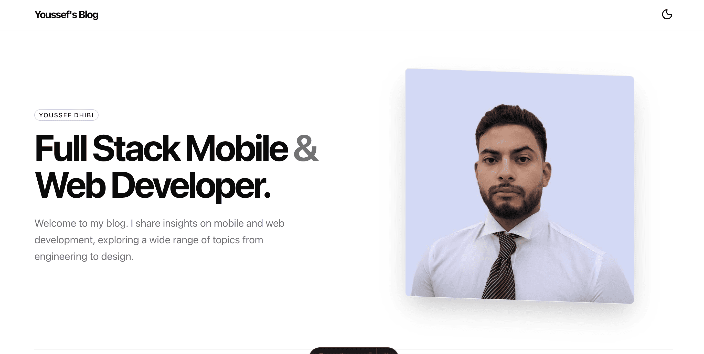

# Astro Blog

A modern, performant, and beautifully designed personal blog built with Astro 5, Tailwind CSS 4, and shadcn/ui components. This project provides a clean foundation for developers who want to create their own blog with best practices baked in.



## Features

**Performance First**
- Built on Astro 5 with zero JavaScript by default
- Automatic lazy loading for images
- Optimized asset delivery and caching

**Modern Design System**
- shadcn/ui components for consistent, accessible UI
- Tailwind CSS 4 for utility-first styling
- Dark and light mode with system preference detection
- Smooth animations and micro-interactions
- Responsive layout for all screen sizes

**Content Management**
- Astro Content Collections for type-safe markdown posts
- MDX support for interactive content
- Automatic reading time calculation
- Category and date organization

**SEO Optimized**
- Dynamic sitemap generation on every build
- Open Graph and Twitter Card meta tags
- JSON-LD structured data (WebSite, Person, BlogPosting schemas)
- Canonical URLs and proper heading hierarchy
- robots.txt configuration
- Complete favicon set for all platforms

**Developer Experience**
- TypeScript support
- Hot module replacement during development
- Clean project structure
- Reusable component architecture

## Tech Stack

| Technology | Purpose |
|------------|---------|
| [Astro 5](https://astro.build) | Static site generator |
| [Tailwind CSS 4](https://tailwindcss.com) | Styling framework |
| [shadcn/ui](https://ui.shadcn.com) | UI component library |
| [React 19](https://react.dev) | Interactive components |
| [MDX](https://mdxjs.com) | Enhanced markdown |
| [TypeScript](https://typescriptlang.org) | Type safety |

## Quick Start

### Prerequisites

- Node.js 18 or higher
- pnpm (recommended), npm, or yarn

### Installation

1. Clone the repository

```bash
git clone https://github.com/youssefsz/Astro-Blog-Website.git
cd astro-blog
```

2. Install dependencies

```bash
pnpm install
```

3. Start the development server

```bash
pnpm dev
```

4. Open your browser and visit `http://localhost:4321`

## Project Structure

```
├── public/
│   ├── favicons/          # Favicon files for all platforms
│   ├── Posts/             # Post images and assets
│   ├── og-img.png         # Open Graph image
│   └── robots.txt         # Crawler instructions
├── src/
│   ├── components/
│   │   └── ui/            # shadcn/ui components
│   ├── content/
│   │   ├── posts/         # Blog posts in markdown
│   │   └── config.ts      # Content collection schema
│   ├── layouts/
│   │   └── Layout.astro   # Base layout with SEO
│   ├── lib/               # Utility functions
│   ├── pages/             # Route pages
│   └── styles/
│       └── global.css     # Global styles and theme
├── astro.config.mjs       # Astro configuration
├── tailwind.config.js     # Tailwind configuration
└── tsconfig.json          # TypeScript configuration
```

## Writing Posts

Create a new markdown file in `src/content/posts/`:

```markdown
---
title: "Your Post Title"
excerpt: "A brief description of your post"
category: "Development"
date: "2026-01-23"
readTime: "5 min read"
image: "/Posts/your-image.webp"
---

Your content goes here.
```

### Frontmatter Schema

| Field | Type | Required | Description |
|-------|------|----------|-------------|
| title | string | Yes | Post title |
| excerpt | string | Yes | Brief description for cards and SEO |
| category | string | Yes | Post category |
| date | string | Yes | Publication date (YYYY-MM-DD) |
| readTime | string | Yes | Estimated reading time |
| image | string | No | Cover image path |

## Available Scripts

| Command | Description |
|---------|-------------|
| `pnpm dev` | Start development server |
| `pnpm build` | Build for production |
| `pnpm preview` | Preview production build locally |

## Customization

### Site Configuration

Update the site metadata in `src/layouts/Layout.astro`:

```javascript
const siteName = "Your Blog Name";
const siteUrl = "https://yourdomain.com";
const authorName = "Your Name";
const twitterHandle = "@yourhandle";
```

### Styling

The design system is configured in `src/styles/global.css`. Modify CSS custom properties to adjust colors, typography, and spacing for both light and dark themes.

### Adding Components

This project uses shadcn/ui. Add new components using the shadcn CLI and they will be placed in `src/components/ui/`.

## Deployment

This project can be deployed to any static hosting platform:

- [Vercel](https://vercel.com)
- [Netlify](https://netlify.com)
- [Cloudflare Pages](https://pages.cloudflare.com)
- [GitHub Pages](https://pages.github.com)

### Build for Production

```bash
pnpm build
```

The output will be in the `dist/` directory.

## Contributing

Contributions are welcome. Feel free to open issues or submit pull requests.

1. Fork the repository
2. Create your feature branch (`git checkout -b feature/amazing-feature`)
3. Commit your changes (`git commit -m 'Add some amazing feature'`)
4. Push to the branch (`git push origin feature/amazing-feature`)
5. Open a Pull Request

## License

This project is released under the MIT License. You are free to use, modify, and distribute this project for any purpose.

```
MIT License

Copyright (c) 2026 Youssef Dhibi

Permission is hereby granted, free of charge, to any person obtaining a copy
of this software and associated documentation files (the "Software"), to deal
in the Software without restriction, including without limitation the rights
to use, copy, modify, merge, publish, distribute, sublicense, and/or sell
copies of the Software, and to permit persons to whom the Software is
furnished to do so, subject to the following conditions:

The above copyright notice and this permission notice shall be included in all
copies or substantial portions of the Software.

THE SOFTWARE IS PROVIDED "AS IS", WITHOUT WARRANTY OF ANY KIND, EXPRESS OR
IMPLIED, INCLUDING BUT NOT LIMITED TO THE WARRANTIES OF MERCHANTABILITY,
FITNESS FOR A PARTICULAR PURPOSE AND NONINFRINGEMENT. IN NO EVENT SHALL THE
AUTHORS OR COPYRIGHT HOLDERS BE LIABLE FOR ANY CLAIM, DAMAGES OR OTHER
LIABILITY, WHETHER IN AN ACTION OF CONTRACT, TORT OR OTHERWISE, ARISING FROM,
OUT OF OR IN CONNECTION WITH THE SOFTWARE OR THE USE OR OTHER DEALINGS IN THE
SOFTWARE.
```

## Author

Created by [Youssef Dhibi](https://youssef.tn)
